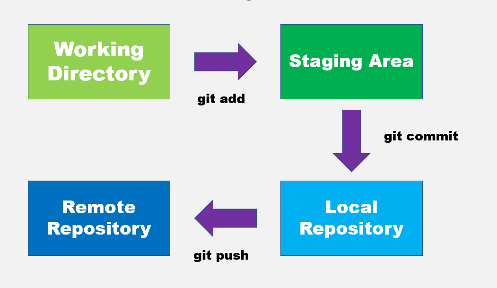

# Git Guide

## 2 ways to start working with a git repository

To create a repository from scratch
```
git init
```

To make a copy of a repository that already exists
```
git clone "INSERT URL HERE"
```

----------------------

## When we operate with git our files are 

**Tracked** 

3 main states: Modified, Staged and Committed. 



OR 

**Untracked** 

Not in the current directory.

## Working Tree 

The area outside of the git directory.

it is like a work bench where you perform all the modifications you want to your file.

## To make a git track a file 
```
git add FILE NAME
```

## Stage all (new, modified, deleted) files in current folder

```
git add .
```

## The staging area 
Also known as the index, contains all of the information about what files and changes are going into the next commit.


## To get some info about the current working tree and pending changes 
```
git status
```

## To get the files/file commited into the git directory
```
git commit 
```

## To add a short commit message without opening a text editor
```
git commit -m "YOUR MESSAGE"
```

## To unset and set and editor for git commit messages 

To unset the editor.
```
git config --global --unset-all core.editor
```

OR

```
git config --unset-all core.editor
```

To set the editor. In this example "atom" is set as the default editor.
```
git config core.editor 'atom -w'
```


## To display commit messages from the commit history
```
git log
```

## To look at the current configuration
```
git config -l
```

## A shorcut to stage any changes to tracked files and commit them in one step

```
git commit -a -m "YOUR MESSAGE"
```


**git uses the HEAD alias to represent the currently checked-ou snapshot of your project**

## To see what changes were made to the files in the repository

In this example "-2" limits the output to the last two entries.

With this command the commits are shown in detail which means the changes that were made are shown.
```
git log -p -2
```

## Filter most recent commits
With this command only the commits with their commit messages are shown.
```
git log -n 2
```

## To see a change in a specific file 
The ID is the identifier next to the word commit in the log.
```
git show INSERT ID
```

## To show some stats about the changes in the commit 

Shows which files were changed and how many lines were added or removed.

```
git log --stat
```

## To help us keep track of our changes
```
git diff
```

## To review changes before adding them 
```
git add -p 
```

## To see changes that are staged but not commited 
```
git diff --staged 
```

-------------------------

**For these next commands to work, the files need to be already commited**

## To remove files from the repository
```
git rm FILE NAME
```

## To rename files in the repository
```
git mv FILE_NAME NEW_FILE_NAME
```

## To ignore a file so that it does not add noise  
```
echo FILE NAME > .gitignore
```

------------------------------------

**For these next commands to work, the files should NOT be staged**

## To change a file back to its earlier commited state
```
git restore/checkout FILE NAME
```

## To add all changes done in the working tree to the staging area

```
git add *
```

-------------------------------------

**For these next commands to work, the files should be staged**

## To change a file to an unstaged file 
```
git restore --staged FILE NAME 
```
```
git reset HEAD FILE NAME 
```
--------------------------------------- 

## To overwrite the previous commit
Only to be used for private use not in public repositories.

This is used in case the commit message was wrong.

```
git commit --amend
```

## To go back to the previous commit in case the code does not work as planned 

```
git revert HEAD
```

## To undone a change that was applied before
```
git revert INSERT ID
```

# Branches

## To check how many branches there are 
```
git branch
```

## To create a new branch
```
git branch INSERT NAME 
```

## To switch to another branch 
```
git checkout BRANCH NAME 
```

## To create a new branch and switch right away to it 
```
git checkout -b BRANCH NAME
```

## To delete a branch 
```
git branch -d BRANCH NAME 
```

## To merge a branch to the main branch 

Once the branch is merged make sure to delete the branch afterwards.

```
git merge BRANCH NAME
```

## To look at commits as a graph and only see one line per commit
```
git log --graph --oneline 
```

## To cancel the merging if something goes wrong

```
git merge --abort
```

## To upload files in our repos in github
```
git push
```

## To retrieve new changes from the repository
```
git pull
```

## To look at the configuration of the remote repo

You will get two URL's, if they start with "http" you will only have read only access, and "https" for access control.

```
git remote -v
```

## To get more information on the remote
```
git remote show origin
```

## To synch data from the remote repo

Does not merge! 
```
git fetch
```

## To get contents of remote branches without automatically merging any contents into the local branches

So we can call merge or checkout as needed.

```
git remote update
```

## To create a branch in the remote repository and push our changes

```
git push -u origin BRANCH NAME 
```

## To base one of the branches into the master branch 

```
git rebase master
```

## Forking
A way of creating a copy of the given repository so that it belongs to our user.

## Pull request
A commit or series of commits that you send to the owner of the repository so that they incorporate it into their tree.


